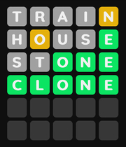

# Wordle

This is a re-playable version of [Wordle](https://www.nytimes.com/games/wordle/index.html), a game developed by New York Times. The objective of the game is to guess the correct answer with 5-letter words in six tries.

## How to play

Start the game by keying in a 5-letter word of your choice. Entering the word will give clues that will lead to the correct word, which is indicated based on the colour of each letter. Continue guessing different words with the clues given until you find the correct answer.

### Meaning of Clues

| Key |  |  |  |
| :---: | :---: | :---: | :---: |
| Meaning | The letter does not exist in the word. | The letter does exist in the word, but it is located at the wrong position. | The letter exists in the word and is at the right position. |

## Libraries used

[React](https://svelte.dev/) (web framework)

[Framer Motion](https://framer.com/motion) (animations)

[Tailwind CSS](https://tailwindcss.com/) (utility-styling)
